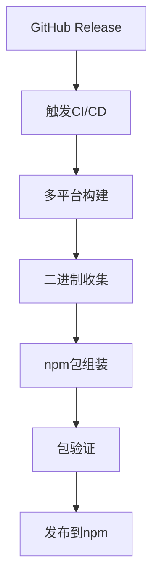

# codex-cli 模块详细文档

## 项目概述

codex-cli是OpenAI Codex CLI的TypeScript/Node.js实现，虽然被标记为"遗留版本"，但它在项目中扮演着重要的角色：作为Rust二进制文件的npm包装器和分发渠道，同时提供了完整的容器化解决方案。

## 当前架构定位

### 从独立实现到包装器的转变

codex-cli经历了重要的架构演进：
- **历史**: 完整的TypeScript/Node.js AI编程助手实现
- **现状**: 主要作为Rust版本的npm包装器和分发工具
- **价值**: 提供零配置的npm安装体验和Docker容器化支持

### 双重身份

```
codex-cli/
├── 包装器功能 (当前主要用途)
│   ├── npm包分发
│   ├── 平台检测
│   ├── 二进制调度
│   └── 进程管理
└── 遗留功能 (文档参考)
    ├── 完整CLI实现
    ├── 多模型支持
    ├── Docker沙箱
    └── 工具集成
```

## 核心组件详解

### 1. 入口点系统 (bin/codex.js)

#### 平台检测与二进制选择
```javascript
const { platform, arch } = process;

let targetTriple = null;
switch (platform) {
  case "linux":
    switch (arch) {
      case "x64": targetTriple = "x86_64-unknown-linux-musl"; break;
      case "arm64": targetTriple = "aarch64-unknown-linux-musl"; break;
    }
    break;
  case "darwin":
    switch (arch) {
      case "x64": targetTriple = "x86_64-apple-darwin"; break;
      case "arm64": targetTriple = "aarch64-apple-darwin"; break;
    }
    break;
  case "win32":
    switch (arch) {
      case "x64": targetTriple = "x86_64-pc-windows-msvc"; break;
      case "arm64": targetTriple = "aarch64-pc-windows-msvc"; break;
    }
    break;
}
```

#### 进程管理与信号处理
```javascript
// 异步spawn确保信号传递
const child = spawn(binaryPath, process.argv.slice(2), {
  stdio: "inherit",
  env: { ...process.env, PATH: updatedPath, CODEX_MANAGED_BY_NPM: "1" },
});

// 信号转发机制
const forwardSignal = (signal) => {
  if (child.killed) return;
  try {
    child.kill(signal);
  } catch { /* ignore */ }
};

["SIGINT", "SIGTERM", "SIGHUP"].forEach((sig) => {
  process.on(sig, () => forwardSignal(sig));
});
```

#### 退出状态处理
```javascript
const childResult = await new Promise((resolve) => {
  child.on("exit", (code, signal) => {
    if (signal) {
      resolve({ type: "signal", signal });
    } else {
      resolve({ type: "code", exitCode: code ?? 1 });
    }
  });
});

// 正确的退出状态传递
if (childResult.type === "signal") {
  process.kill(process.pid, childResult.signal);
} else {
  process.exit(childResult.exitCode);
}
```

### 2. 构建与发布系统

#### build_npm_package.py - 核心构建脚本
```python
def main():
    """主构建流程"""
    args = parse_args()
    
    # 1. 准备构建环境
    staging_dir = setup_staging_directory(args)
    
    # 2. 下载或构建二进制文件
    if args.workflow_url or args.release_version:
        download_binaries_from_github(args, staging_dir)
    else:
        build_local_binaries(staging_dir)
    
    # 3. 组装npm包
    assemble_npm_package(staging_dir, args.version)
    
    # 4. 验证包完整性
    validate_package(staging_dir)
```

#### 多平台二进制管理
```
vendor/
├── x86_64-unknown-linux-musl/
│   └── codex/codex
├── aarch64-unknown-linux-musl/
│   └── codex/codex
├── x86_64-apple-darwin/
│   └── codex/codex
├── aarch64-apple-darwin/
│   └── codex/codex
└── x86_64-pc-windows-msvc/
    └── codex/codex.exe
```

### 3. Docker容器化解决方案

#### Dockerfile分析
```dockerfile
FROM node:24-slim

# 安装开发工具和安全工具
RUN apt-get update && apt-get install -y --no-install-recommends \
  aggregate \        # 网络聚合工具
  ca-certificates \  # SSL证书
  iptables \         # 防火墙
  ipset \           # IP集合管理
  ripgrep \         # 快速搜索
  # ... 其他工具
  && rm -rf /var/lib/apt/lists/*
```

#### 容器安全特性
1. **网络隔离**: 通过iptables规则限制网络访问
2. **用户权限**: 非root用户运行
3. **文件系统**: 只读根文件系统，特定目录可写
4. **资源限制**: CPU和内存限制

#### run_in_container.sh - 容器运行脚本
```bash
#!/bin/bash
# 容器化运行Codex的完整脚本

# 1. 检查Docker可用性
check_docker_available() {
    if ! command -v docker &> /dev/null; then
        echo "Docker is not installed or not in PATH"
        exit 1
    fi
}

# 2. 构建容器镜像
build_container_if_needed() {
    if [[ ! "$(docker images -q codex-sandbox 2> /dev/null)" ]]; then
        echo "Building codex-sandbox container..."
        docker build -t codex-sandbox .
    fi
}

# 3. 配置网络隔离
setup_network_isolation() {
    # iptables规则配置
    # 只允许访问OpenAI API
}

# 4. 挂载工作目录并运行
run_in_container() {
    docker run --rm -it \
        --cap-add=NET_ADMIN \
        --security-opt apparmor:unconfined \
        -v "$PWD:/workspace" \
        -w /workspace \
        codex-sandbox \
        codex "$@"
}
```

### 4. 安全与沙箱机制

#### init_firewall.sh - 防火墙初始化
```bash
#!/bin/bash
# 初始化容器防火墙规则

# 清除现有规则
iptables -F
iptables -X

# 默认策略：拒绝所有
iptables -P INPUT DROP
iptables -P FORWARD DROP
iptables -P OUTPUT DROP

# 允许本地回环
iptables -A INPUT -i lo -j ACCEPT
iptables -A OUTPUT -o lo -j ACCEPT

# 允许OpenAI API访问
iptables -A OUTPUT -d api.openai.com -p tcp --dport 443 -j ACCEPT

# 允许DNS解析
iptables -A OUTPUT -p udp --dport 53 -j ACCEPT
```

### 5. 依赖管理

#### package.json - 最小化依赖
```json
{
  "name": "@openai/codex",
  "version": "0.0.0-dev",
  "license": "Apache-2.0",
  "bin": {
    "codex": "bin/codex.js"
  },
  "type": "module",
  "engines": {
    "node": ">=20"
  },
  "files": [
    "bin",      // 入口脚本
    "vendor"    // 预编译二进制文件
  ]
}
```

#### install_native_deps.py - 原生依赖安装
```python
def install_native_deps():
    """安装平台特定的原生依赖"""
    platform = get_current_platform()
    
    if platform.startswith('linux'):
        install_linux_deps()
    elif platform.startswith('darwin'):
        install_macos_deps()
    elif platform.startswith('win'):
        install_windows_deps()
```

## 发布流程详解

### 1. 自动化构建流程



### 2. 版本管理策略

#### 语义化版本控制
- **0.1.x**: TypeScript原生实现
- **0.2.x+**: Rust二进制包装器版本

#### 版本同步机制
```python
def sync_versions():
    """同步Rust版本到npm包版本"""
    rust_version = get_rust_cli_version()
    npm_version = increment_npm_version(rust_version)
    update_package_json(npm_version)
```

### 3. 质量保证

#### 包完整性检查
```python
def validate_package(staging_dir):
    """验证npm包完整性"""
    # 1. 检查所有目标平台的二进制文件
    for target in SUPPORTED_TARGETS:
        binary_path = staging_dir / "vendor" / target / "codex"
        assert binary_path.exists(), f"Missing binary for {target}"
    
    # 2. 验证package.json格式
    package_json = load_package_json(staging_dir)
    validate_package_json_schema(package_json)
    
    # 3. 测试入口点
    test_entry_point(staging_dir)
```

#### 跨平台测试
```bash
# CI/CD中的测试流程
test_platforms() {
    for platform in linux-x64 linux-arm64 darwin-x64 darwin-arm64; do
        echo "Testing on $platform"
        run_test_suite_on_platform $platform
    done
}
```

## 遗留功能架构 (参考价值)

### 1. 原TypeScript实现特性

虽然现在主要作为包装器，但原有的TypeScript实现展示了完整的AI编程助手架构：

#### 多模型支持
```typescript
interface ModelProvider {
    name: string;
    baseURL: string;
    apiKey: string;
    createCompletion(request: CompletionRequest): Promise<CompletionResponse>;
}

class OpenAIProvider implements ModelProvider {
    // OpenAI实现
}

class AzureProvider implements ModelProvider {
    // Azure实现
}

class GeminiProvider implements ModelProvider {
    // Gemini实现
}
```

#### 沙箱执行引擎
```typescript
class DockerSandbox {
    async executeCommand(command: string, args: string[]): Promise<ExecutionResult> {
        const container = await this.createContainer();
        const result = await container.exec(command, args);
        await container.cleanup();
        return result;
    }
}
```

#### 配置系统
```typescript
interface CodexConfig {
    model: string;
    provider: string;
    approvalMode: 'suggest' | 'auto-edit' | 'full-auto';
    sandboxMode: 'docker' | 'none';
    customInstructions?: string;
}
```

### 2. 工具集成系统

#### 内置工具
- **文件操作**: 读取、编辑、创建文件
- **Shell命令**: 安全的命令执行
- **Git集成**: 版本控制操作
- **包管理**: npm、pip、cargo等集成

#### 扩展机制
```typescript
interface Tool {
    name: string;
    description: string;
    execute(args: ToolArgs): Promise<ToolResult>;
}

class ToolRegistry {
    register(tool: Tool): void;
    execute(toolName: string, args: ToolArgs): Promise<ToolResult>;
}
```

## 现代化迁移考虑

### 为什么保留TypeScript包装器

1. **生态系统兼容**: npm生态系统的深度集成
2. **零配置体验**: `npm install -g @openai/codex`一键安装
3. **跨平台分发**: 自动选择合适的二进制版本
4. **Docker集成**: 完整的容器化解决方案

### 技术债务管理

```python
# 构建脚本中的版本管理
SUPPORTED_TARGETS = [
    "x86_64-unknown-linux-musl",
    "aarch64-unknown-linux-musl", 
    "x86_64-apple-darwin",
    "aarch64-apple-darwin",
    "x86_64-pc-windows-msvc",
    "aarch64-pc-windows-msvc",  # 未来支持
]

def manage_legacy_compatibility():
    """管理遗留兼容性"""
    # 保持API兼容性
    # 逐步迁移功能
    # 文档更新
```

## 部署架构

### npm发布流程
```bash
# 1. 构建包
./scripts/build_npm_package.py --release-version 0.6.0

# 2. 验证包
cd /tmp/staged_package
npm pack --dry-run

# 3. 发布
npm publish
```

### Docker镜像管理
```dockerfile
# 多阶段构建优化
FROM rust:1.70 as builder
COPY codex-rs/ /src
RUN cargo build --release

FROM node:24-slim
COPY --from=builder /src/target/release/codex /usr/local/bin/
COPY codex-cli/ /opt/codex-cli/
```

## 监控与诊断

### 运行时监控
```javascript
// 进程监控
child.on('error', (err) => {
    console.error('Binary execution failed:', err);
    process.exit(1);
});

child.on('exit', (code, signal) => {
    if (signal) {
        console.log(`Child process terminated by signal: ${signal}`);
    } else {
        console.log(`Child process exited with code: ${code}`);
    }
});
```

### 诊断工具
```bash
# 环境检查
codex --version
node --version
docker --version

# 二进制验证
ls -la ~/.codex/
file vendor/*/codex/*
```

---

## 总结

codex-cli从一个完整的TypeScript AI编程助手实现转变为Rust版本的智能包装器，这种架构选择体现了以下优势：

1. **最佳实践融合**: 结合Node.js生态的分发优势和Rust的性能优势
2. **用户体验**: 保持零配置安装体验
3. **维护效率**: 单一核心实现，多种分发渠道
4. **安全增强**: Docker容器化提供额外的安全层

这种混合架构为AI编程工具的分发和部署提供了一个优秀的参考模式，平衡了开发效率、用户体验和系统性能。
